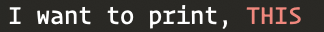
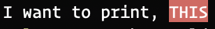

### Tint Color Expressions (TCE)

In `v0.0.1` tint introduced a new way to style your output. This solution was better than [Palette](getting_started.md#func-palette) as it was
declared inline and did not have to create new [Mixin](getting_started.md#func-with) instances.

Now this turned out to be pretty annoying when it is a really annoying whe you had
a really long string and want to color specific parts of it. This had me thinking about
a feature that would allow us to write in string format and let the [Exp](getting_started.md#func-exp) 
take care of the rest. 


#### A gentle example

A down-to-earth example of Exp func can be found [here](getting_started.md#func-exp). But lets break down this exprssion
a bit more.

```go
printThis := t.Exp("I want to print, r|THIS|!")
fmt.Println(printThis)
```  

a more insight on this expression:

<pre>t.Exp("I want to print, <b>r|</b> THIS <b>|!</b>")</pre>

You can see that the _THIS_ word `r|` prefix and a `|!` suffix which tells to populate with it's respective unicode
brackets. 



Lets paint a background to the _THIS_ word now:

```go
printThis := t.Exp("I want to print, +r|THIS|+")
fmt.Println(printThis)
```  

which will yeild this:



You can now conclude that the colored text solely depends upon the prefix and suffix that it is wrapped with.

Take look at expression set below.


#### Color set

| **Color** | **Prefix** | **Suffix** |
| ------------ | --------------| ------------|
| Black | <code>bl&#124;</code> | <code>&#124;!</code> |
| Red | <code>r&#124;</code> | <code>&#124;!</code> |
| Green | <code>g&#124;</code> | <code>&#124;!</code> |
| Yellow | <code>y&#124;</code> | <code>&#124;!</code> |
| Blue | <code>b&#124;</code> | <code>&#124;!</code> |
| Magenta | <code>m&#124;</code> | <code>&#124;!</code> |
| Cyan | <code>c&#124;</code> | <code>&#124;!</code> |
| White | <code>w&#124;</code> | <code>&#124;!</code> |
| Black Bold | <code>*bl&#124;</code> | <code>&#124;!</code> |
| Red Bold | <code>*r&#124;</code> | <code>&#124;!</code> |
| Green Bold | <code>*g&#124;</code> | <code>&#124;!</code> |
| Yellow Bold | <code>*y&#124;</code> | <code>&#124;!</code> |
| Blue Bold | <code>*b&#124;</code> | <code>&#124;!</code> |
| Magenta Bold | <code>*m&#124;</code> | <code>&#124;!</code> |
| Cyan Bold | <code>*c&#124;</code> | <code>&#124;!</code> |
| White Bold | <code>*w&#124;</code> | <code>&#124;!</code> |
| Black Background | <code>+bl&#124;</code> | <code>&#124;+</code> |
| Red Background | <code>+r&#124;</code> | <code>&#124;+</code> |
| Green Background | <code>+g&#124;</code> | <code>&#124;+</code> |
| Yellow Background | <code>+y&#124;</code> | <code>&#124;+</code> |
| Blue Background | <code>+b&#124;</code> | <code>&#124;+</code> |
| Magenta Background | <code>+m&#124;</code> | <code>&#124;+</code> |
| Cyan Background | <code>+c&#124;</code> | <code>&#124;+</code> |
| White Background | <code>+w&#124;</code> | <code>&#124;+</code> |
| Dim Attribute | <code>i&#124;</code> | <code>&#124;></code> |


#### Expression set

The below representation of tint covers the expression structure:

| **Feature** | **Prefix** | **Suffix** |
| ------------ | --------------| ------------|
| Foreground | <code>{color}&#124;</code> | <code>&#124;!</code>  |
| Foreground-Bold | <code>*{color}&#124;</code> | <code>&#124;!</code>  |
| Background | <code>+{color}&#124;</code> | <code>&#124;+</code>  |
| Attributes | <code>{attr}&#124;</code> | <code>&#124;></code>  |

